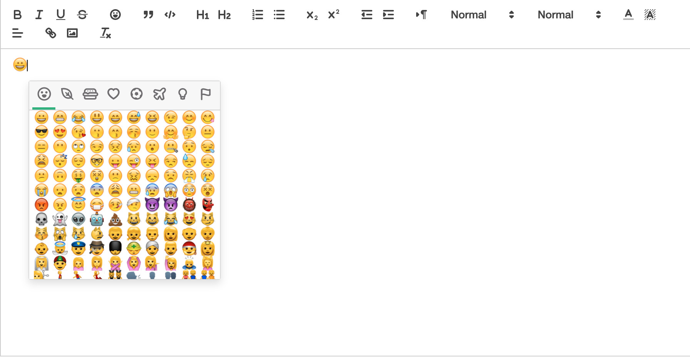
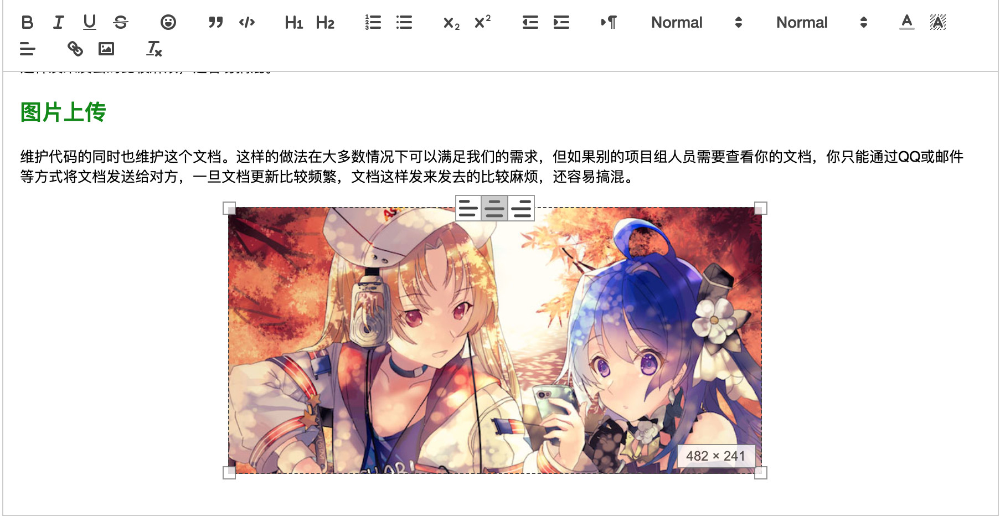

# vue项目使用quill-editor富文本编辑器

这是一个通过quill-editor实现富文本编辑器的vue项目，编辑器实现基本功能以及图片自定义上传、图片resize和表情。





## Build Setup


```bash
# clone the project
git clone https://github.com/copoile/quill-editor-demo.git

# enter the project directory
cd quill-editor-demo

# install dependency
npm install

# develop
npm run dev
```

This will automatically open http://localhost:9528

## Build

```bash
# build for test environment
npm run build:stage

# build for production environment
npm run build:prod
```


